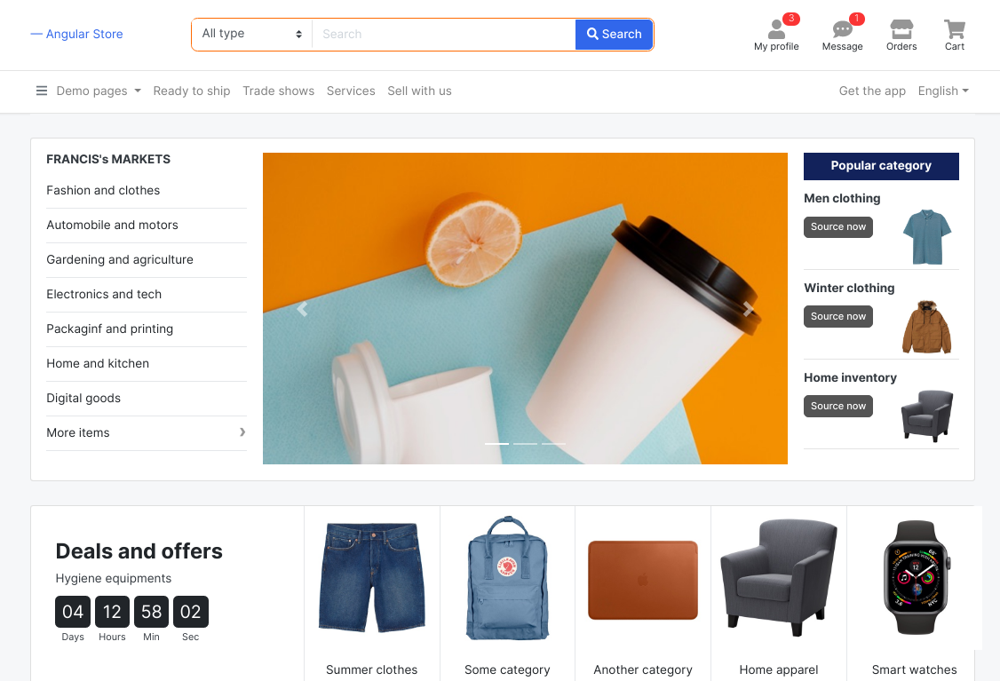

# NgCommerceApp

Angular template for e-commerce.

This project is part of a hands-on series about building templates using Angular.

- Medium article: https://medium.com/p/c299e26aa51
- Repo author: [Francis Rodrigues](https://github.com/francisrod01)
- Designed by: [Ajay Malhotra](https://therichpost.com/angular-11-bootstrap-4-5-ecommerce-template-free/)

## How to run it

### Development server

Run `ng serve` for a dev server. Navigate to `http://localhost:4200/`. The app will automatically reload if you change any of the source files.

### Build

Run `ng build` to build the project. The build artifacts will be stored in the `dist/` directory. Use the `--prod` flag for a production build.

### Technical information

This project was created with [Angular CLI](https://github.com/angular/angular-cli) version 11.1.4.

## License

MIT
